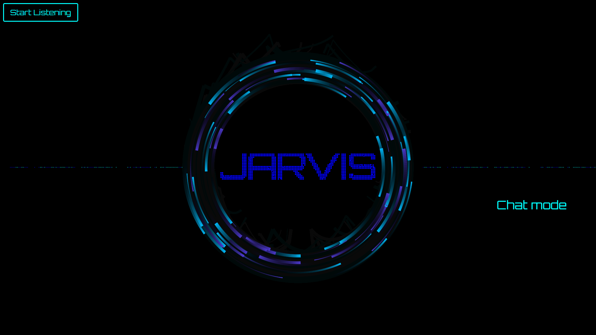
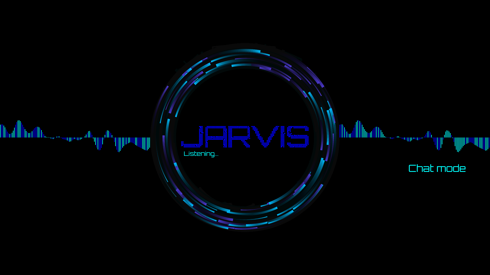
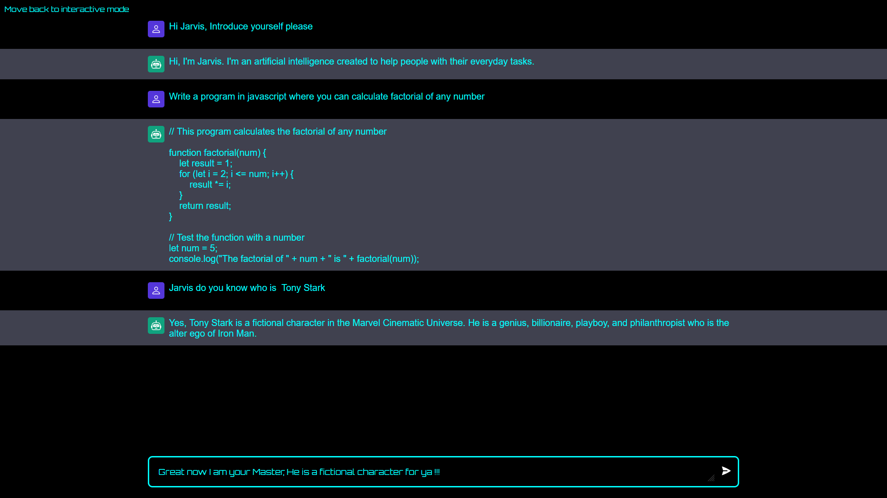

# JARVIS




JARVIS is an artificial intelligent interactive bot who recognizes human speech and gives answers to all his queries just like Chatgpt but more interactive. It can perform system automation tasks and browser automation too. The AI is made using CHATGPT API

## Note
Presently only the chat mode is functional and the program can chat with you in text mode and interactive mode only. Command mode will be added soon.

## Getting Started

After cloning the project open the project folder run the following commands in terminal
```
cd client

npm run dev
```

### Prerequisites

There are some prequisites required to be installed before using the software. 
- [Node.js](https://nodejs.org/en)
- [Vite](https://vitejs.dev/)

You will also require the ChatGPT API
- Visit [openai.com/API/](https://openai.com/product) and sign up


- Then follow these steps to get your own API


- Copy the api key then paste here


### Installing

You can easily install node.js visiting the official website and download directly from there.

To install vite for the project open the project and open terminal inside client folder and run the following command.

    npm install vite@latest

To start the program, 
- move to the client folder and run.

```
    npm run dev
```

- move to the server folder in a new terminal and run.

```
    npm run server
```

## Authors

  - **Swaraj Kumar Biswal** -
    [SWARAJ-42](https://github.com/SWARAJ-42/)


## Acknowledgments
  - Thanks to [Frank's Laboratory](https://www.youtube.com/@Frankslaboratory), [javascript-mastery](https://www.youtube.com/@javascriptmastery), [Chris-Courses](https://www.youtube.com/@ChrisCourses), their tutorials helped me build my project.
